# World trade data

Two opinions raise by the analysis

-   Every country trade with limited other countries.
    And there are not any country expanding to every other country.
-   The world has only little countries that dominate the international trading.

---

-   [World trade data](#world-trade-data)
    -   [Trading partnership](#trading-partnership)
    -   [Trading partnership in Sankey Diagram](#trading-partnership-in-sankey-diagram)
    -   [Important country](#important-country)
        -   [Degree map](#degree-map)
        -   [Partnership map](#partnership-map)

I collect the data from
[wits](https://wits.worldbank.org/data/public/cp/wits_en_trade_summary_allcountries_allyears.zip "wits").
The full name of the website is World Integrated Trade Solution,
and it is a quite useful data website.

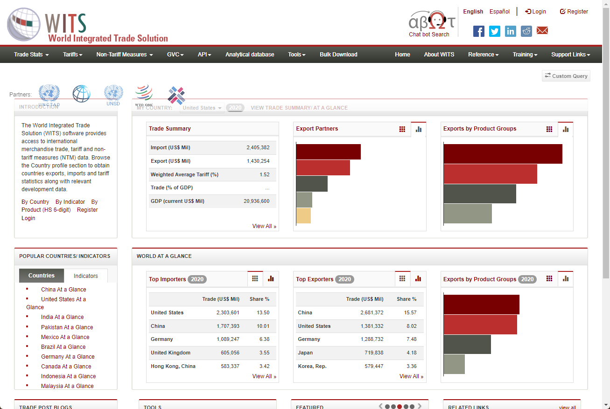

## Trading partnership

Specifically,
the data of trading partnership across countries is collected from the website,
and I place them in the folder of
[wits*en_trade_summary*...](wits_en_trade_summary_allcountries_allyears).

In every .csv files,
trading partnership of the country is provided.
I am interested in the records being named as

-   'Trade (US$ Mil)-Top 5 Export Partner'
-   'Trade (US$ Mil)-Top 5 Import Partner'

The meaning is the top 5 partnership countries,
in the trading relationship as Export or Import.
And the unit is a million US dollar.

I use the IPython notebook to process the data,
(see the [readme.ipynb](readme.ipynb)),
and it produces the sorted data as following dataframe

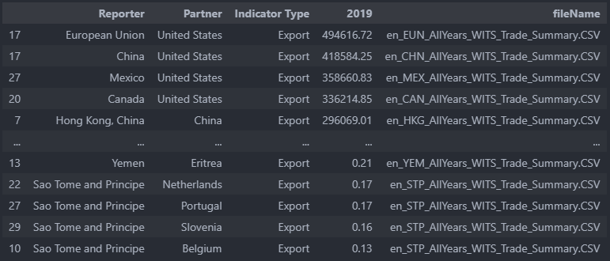
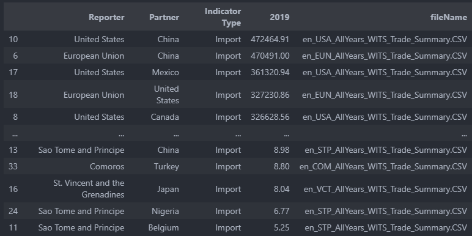

## Trading partnership in Sankey Diagram

Based on the dataframe,
I compute the international trading partnership,
and display them with Sankey Diagram.

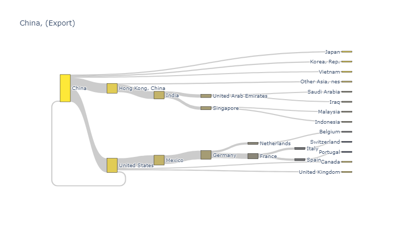

The water-flow width represent the volume of the trading,
and the linked nodes represent the country,
the node colors represent the importance level of the partner country.
And the importance level of the partner country is determined by the searching results

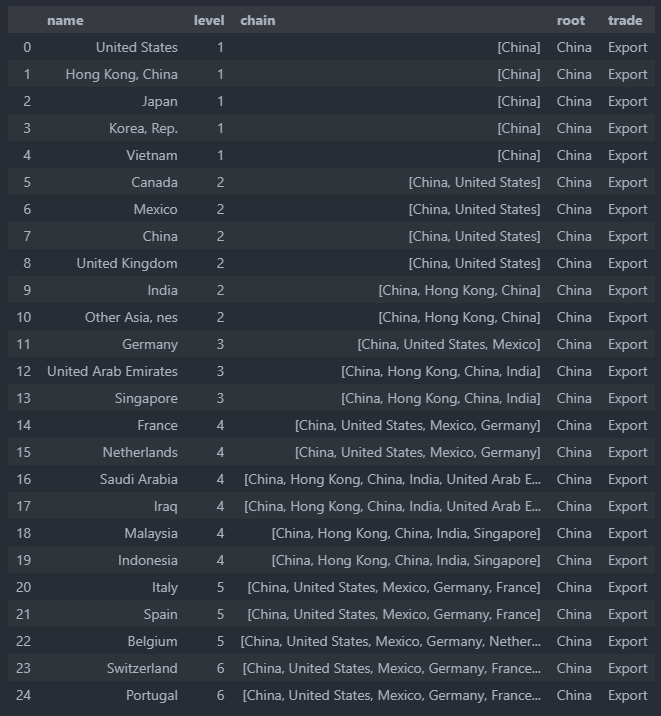

I believe it is self explained.
Here is how the Sankey diagram is constructed.
I just walk through the dataframe starting with the root node,
take "China" for example.
The travel moves into the partners iteratively,
and records every country it passes through.
When a target country is visited,
the 'chain' links the root and target countries is also recorded.
Moreover, the earlier the country is visited,
the more important I believe it is,
and the level is thus smaller.

I have also built a dash app to view the results in UI mode.
You can play with it by yourself

```shell
cd dash
python app.py
```

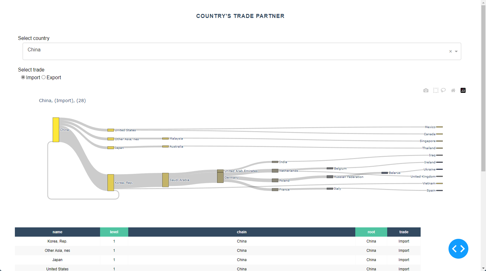
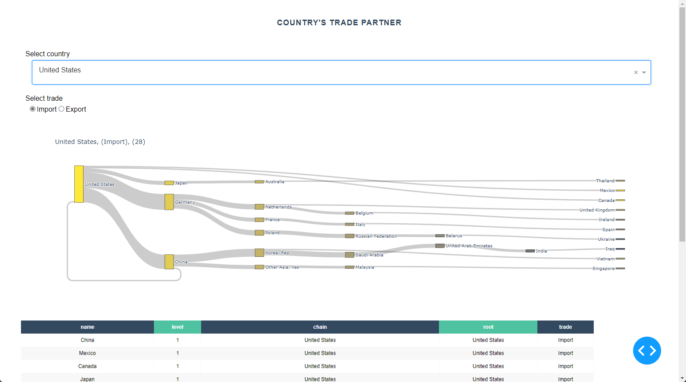

The very thing shocks me a lot is the small lines of the table.
So far as I can see,
there are not any countries that expand to partnerships more than 30.
Thus, I reach my first opinion

> Every country trade with limited other countries.
> And there are not any country expanding to every other country.

## Important country

My next question raises,

> Is there any country significant?

To answer the question,
I play the Sankey analysis for every country,
and produce the degree map for the countries

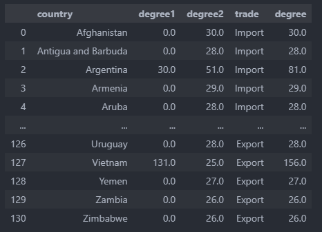

The degrees represent the times of the country being visited.
The degree1 is the times as the source country,
and the degree2 is the times as the target country,
and the degree is the sum of degree1 and degree2.

### Degree map

The degrees are shown below.
I consider it as the importance metric of countries,
the significant countries are Germany, United States, China, Korea. Rep, India, Hong Kong. China, United Arab Emirates, France, Japan, Singapore, Mexico, Russian Federation ....

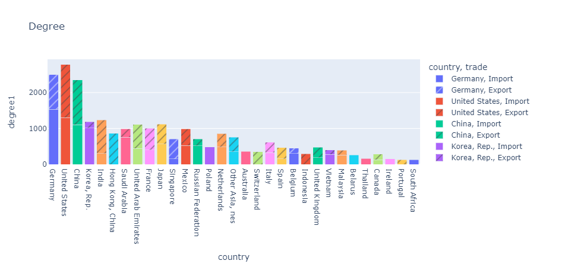

### Partnership map

Moreover, I also analysis the links between countries.
The links between countries are computed for every two countries,
the values are the sum of the trading volume between the two countries.
The links are shown in the sparse matrix

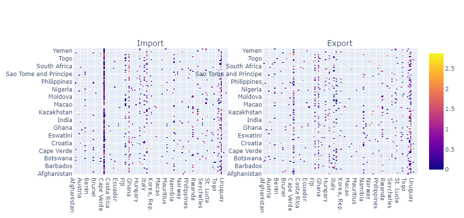

It is interactive graph,
put your mouse on the colored nodes,
it will show the relationship between the two countries.
For example, in the import part,
the most left vertical line represents China.

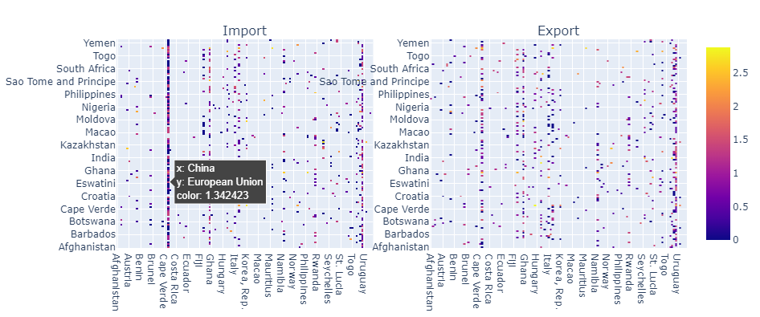

So, I reach to my second opinion,

> The world has only little countries that dominate the international trading.
